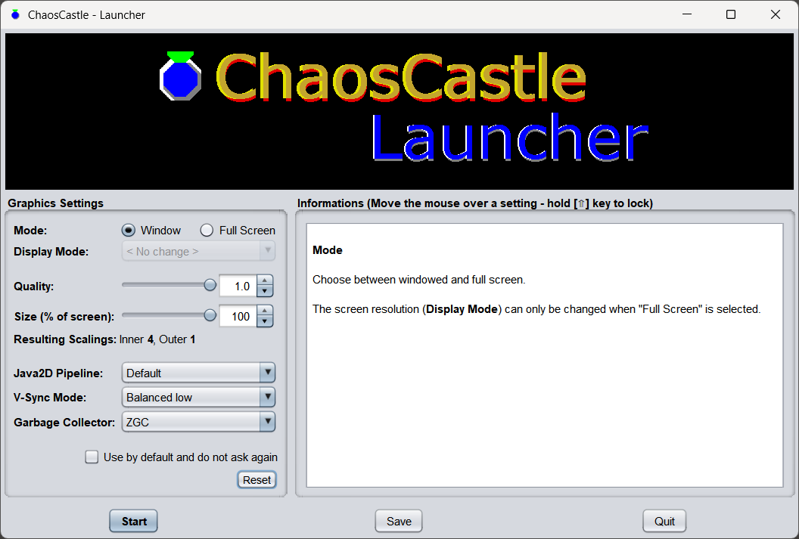

# ChaosCastle

ChaosCastle is a simple, retro-like, 2D shoot-them-up game with a slow pace.

It starts with very simple levels. But as the game progresses, the difficulty and complexity increase.

The game was initially released for the Amiga and Macintosh computers in 1999. This is a Java-port that runs on any modern hardware, and is very close to the original version (see **History** below).

Because this is an almost unmodified port of an old game, please read the instructions carefully (especially **Controls** and **Weapons**), because the game is far from having the conviviality and ease-of-use of your typical Smartphone game.

Oh, and there is no download yet. You have to compile the game from the sources (see ** Compiling**).


# Screenshots

The game has simple graphics. For instance, this is the main character:


And this is a screenshot of the "Garden" level of the "Castle" zone:

TODO

Do not like the graphics? then sorry this game is not for you. If on the other hand you are interested by the gameplay rather than by the graphics (or if you like retro games), you might be interested.


# Installing and running

## Compiling

To compile and run ChaosCastle, you must be familiar with the Command Prompt (Windows) or Terminal (Linux / macOS).

First you need to install:

- A Java JDK version 17 or greater
    - You need a JDK and not just a JRE!
    - On Debian-based Linux, this can be done using `sudo apt install openjdk-17-jdk`
    - On Windows and macOS, the JDK can be downloaded from www.adoptium.net
    - The `JAVA_HOME` environment variable should properly locate the JDK's installation directory. If this environment variable is not properly created during the installation, you may need to create it manually.
- Git
    - On Debian-based Linux, `sudo apt install git`
    - On other systems, https://git-scm.com/downloads
    
Then open a Command Prompt or a Terminal.

- Change the current directory to some new empty directory
- Get the sources of the Modula-2 to Java translator, using `git clone https://github.com/Tachyon-Sonics/Modula2Java17`
    - Whilst the game is already translated to Java, it still needs the small Modula-2 runtime that comes with the translator
- Switch to the latest stable release:
    - `cd Modula2Java17`
    - `git switch release/0.9.0`
    - `cd ..` 
- Get the sources of the ChaosCastle game: `git clone https://github.com/Tachyon-Sonics/ChaosCastle`
- Switch to the latest stable release:
    - `cd ChaosCastle`
    - `git switch release/0.9.0`
- Compile it and create an executable .jar file:
    - On Windows: `gradlew.bat ChaosCastleJar`
    - On Linux or macOS: `./gradle ChaosCastleJar`, or `sh ./gradle ChaosCastleJar` if the former does not work.
    - This takes quite a time, and this will also download a few libraries used by the game. This is where most of the magics happens, and also where problems are most likely to occur...
- If everything went well and without errors, the file `ChaosCastle.jar` can be found in the `ChaosCastle\build\libs` directory (relative to the current one). This is the only file you need to run the game. You can now place it somewhere else where it is easier to find. It still needs a Java JRE *version 17 or more* to run (which you already have as you installed a Java JDK (that includes a JRE) to compile the game). Also note that there is currently no way to do a "installation"; the game is just a portable, single file. Note that the `ChaosCastle.jar` file is 100% cross-platform: it can be used on other operating systems (Windows, Linux, macOS) as long as they have a Java JRE version 17 or greater installed.
- (Optional) cleanup:
    - Once you have copied the `ChaosCastle.jar` somewhere else, you can delete the directory created in the first step.
    - The compilation process has downloaded libraries to the `.gradle` directory in your home. This directory can be deleted as well.


## Starting the game

You need to first install a Java Runtime Environment (JRE) version 17 or greater. If you compiled it from the sources using the instructions above, this should already be done.

From the command line:

`java -jar ChaosCastle.jar`

Or right-click on the `ChaosCastle.jar` file, and choose "Open with OpenJDK" or similar...

This will open a **launcher** window, as shown below.



The original game for Amiga computers ran full-screen at 320x240, 16 colors, because this was the standard and was always supported. Because today's computer have a variety of screen resolutions (most of them are way bigger than 320x240), the **launcher** allows you to specify how to scale the game from its base resolution of 320x240.

If your computer has a resolution between 640x480 and 1920x1080, you can usually accept the default settings and click [**Start**] to start the game. If the resolution is bigger, it may fail to achieve 60 FPS and animations can be jaggy. You may want to change some settings:

- **Quality**: by reducing the value, part of the scaling will be done with lower quality
- **Size (percent of screen)**: if reducing the quality is not enough, here you can make the game use a smaller portion of the screen
- Note that the two above settings control the **Resulting Scales** shown below them. Be sure to modify them in such a way one of the resulting scale changes
- By default, the game starts in a window. If you change the **Mode** to "Full Screen", you can also optionally change the screen resolution in the **Display Mode** setting.

The other settings are quite advanced and usually better left to defaults.

Once started, the title screen of the game appears. Note that the explanation text in the title screen is still exactly that of the original Amiga game, and basically explains how to use the numeric pad of the keyboard to control the main character.

However, Gamepads are fully supported on Windows, macOS and Linux, as well as keyboards without numeric pad. See the **Controls** section below.

Inside the game:
- Move the mouse to pause the game (if in a level).
- Click the right mouse button to open the in-game menu. You can quit using the "Quit" menu.
- There are also menus to load and save games.
- The menu is also accessible from a system tray icon.


## Troubleshooting

If the `ChaosCastle.jar` file does not start, this can be due to the following
- No Java Runtime Environment (JRE) is installed. You must install a JRE version *17 or greater*.
- A JRE of a version less than 17 is installed and used.
    - When this is the case, trying to launch ChaosCastle from the command line will display the following error message (or similar):

```
Error: LinkageError occurred while loading main class ch.chaos.castle.app.ChaosCastleApp
        java.lang.UnsupportedClassVersionError: ch/chaos/castle/app/ChaosCastleApp has been compiled by a more recent version of the Java Runtime (class file version 61.0), this version of the Java Runtime only recognizes class file versions up to 55.0
```

- The `.jar` extension is not set at the operating system level to be opened by the JRE. Use "Open with..." or use the command line.
- The `ChaosCastle.jar` file was incorrectly built. Note that the default gradle target will create it as a library without the required dependencies. Make sure you create it with the `ChaosCastleJar` gradle task.
    - When this is the case, trying to launch it from the command line will display the following error message: `no main manifest attribute, in ChaosCastle.jar`.
    
If the game crashes after starting, it might also be due to a corrupt configuration file. You can reset the settings by deleting the file `ChaosCastle/.settings` in your `Documents` folder. If the top-scores file is corrupted (top scores fail to load - [F1] on title screen), delete the `ChaosCastle/.data/TopScores` file. Note that games are saved by default in the `ChaosCastle` folder which is inside your `Documents` folder.

If scrolling is jaggy during the game, you may change some settings in the launcher:

- Change **V-Sync mode** to "Balanced High" or "Active" (this will take more CPU)
- On Linux, try changing the **Java2D Pipeline** to "OpenGL" (mind that in-game menus and dialogs may not work properly on hardware that is not fully compatible)
- Reduce the values of the **Quality** and/or **Size (% of screen)** settings
  
  
## A few weird things

- The original game was running in full-screen mode on the Amiga, yet it had a menu bar (to load and save the game, to change settings) and dialogs. Menu and dialogs in full-screen mode do not play really well in Java; they work but:
    - The menu is a context menu, even in windowed mode. Use the right mouse button to open it. The background may not refresh properly while the menu is opened.
    - In full-screen mode, dialogs (settings, file chooser to load or save a game) are not resizable or movable.
    - Menu and dialogs may not render properly when using OpenGL or Direct3D on hardware that is not fully compatible.
- The original game had a "File / Hide" menu, that was basically a "bosskey" that fully hides the game. In the Amiga version it could be recalled from the Workbench menu. In the Macintosh version, the main window was hidden, but the menubar was kept, and the "File / Continue" menu could recall the game.
    - In this Java port, a tray icon is always present (it has the game's main character as icon), and has a menu that is the same as the application's one. The "File / Continue" menu can be choosen here to recall the game if you hid it using "File / Hide".
    
These weird features were implemented in order to fully support the original version of the game (with the original, portable part of the code untouched). Future versions will probably remove or change these features.


# The Game  

## Goals

The game has three "zones", each with several levels. The zones are named "Chaos", "Castle" and "Family".

You start in the "**Chaos**" zone at level 1. The goal of any level in this zone is to destroy everything and to collect $.

Between every level, you enter the **shop**. Each time you have collected 100$, you can play a level of the "Castle" zone (by buying it in the shop); else you have to continue with the next level of the "Chaos" zone.

In the "**Castle**" zone, the goal of any level is to collect both $ and £, and to find the "EXIT" panel. Levels in the "Castle" zone are big levels with scrolling. Each time you have collected 150£, you can play a level of the "Family" zone (by buying it in the shop).

In the "**Family**" zone, each level is basically a fight against a boss.

Levels are cycling in every zones. Once the last level of a zone has been done, it restarts with the first one. As such the game never finishes. However, it takes several hours of playing until you can reach the last boss in the "Family" zone. Note that there is an in-game menu (use the right-mouse button to show it) that allows you to load and save games. It can be used when you are in the shop between levels.

There are 20 levels in the "Castle" zone. These levels are procedurally generated. This means that you never play exactly the same level twice, although each level typically has a distinct "feel", based on the procedural algorithm used to generate it. Many "Castle" levels may also appear with a different random orientation / rotation each time you play them.


## Controls

There are three ways of controlling the main character:
- Using a Gamepad
    - Should run out of the box on Windows and macOS, requires libevdev and libudev on Linux, see https://github.com/libgdx/jamepad
    - On Windows the controller is sometimes not recognized. Just unplug it and plug it again.
- Using the keyboard (without numeric pad)
- Using the keyboard (with numeric pad)

All three ways can be used at any time and even combined. You do not have to "select" one at any time.


### Gamepad

- Move with the directional pad
- (A): Fire with the gun
- Left and right bumpers/shoulders (the buttons on the back of the pad): select and cycle through weapons ((A) to cancel)
- (B), (X), (Y): other weapons (see **Weapons** section below). Basically if a weapon is selected, this assigns the button to that weapon. Else, this fires with the assigned weapon, or does nothing if no weapon has been assigned.
    - Analog controls (if any) can each be used for an additional weapon. The pressure and / or direction is however ignored.
    - keys from the keyboard can also be used.

### Keyboard (without numeric pad)

- Move with the arrow keys
- [CTRL]: Fire with the gun
- [Page up] and [Page down]: select and cycle through weapons ([CTRL] to cancel)
- Any other key (except [p] to pause the game): other weapons  (see **Weapons** section below)

### Keyboard (with numeric pad)

- Move with the [1] - [9] keys of the numeric pad
- [0] or [SPACE]: Fire with the gun
- [+] and [-]: select and cycle through weapons ([0] or [SPACE] to cancel)
- Any other key (except [p] to pause the game): other weapons  (see **Weapons** section below)


## Weapons

The "**Gun**" is always available, and is always associated to
- the (A) button of the gamepad
- the [SPACE] bar and the [CTRL] / [0] key (you can use any of them) of the keyboard

To use another weapon, three steps are necessary, in that order:
1. Assign the weapon to a button or key
    - First you must have started the game (and not be in the title screen). This can also be done in the "Shop" that appears between levels
    - When using a Gamepad, use the left and right bumpers/shoulders to highlight the weapon (with the keyboard, use [Page up]/[Page down] or [+]/[-])
    - Then just press the button or key to which you want to assign the weapon.
        - Or press (A) ([SPACE]/[CTRL]/[0]) to cancel (basically the button/key for the "Gun")
    - This process can be done again at any time to assign a different button/key, or for a different weapon.
    - Note: button/key assignment are not preserved when saving a game. Hence if you load a saved game you may need to re-assign a button/key to all your weapons.
2. Add power to that weapon. Power can only be added by finding a power bonus, so you will have to seach for one. They are hidden in some "Castle" levels. A power bonus looks as follows: TODO: image of power bonus
    - When collecting a power bonus, a message asks you to choose a weapon. Just click the button / key of the desired weapon (first assign a key using step 1 if you haven't done it yet)
3. Add bullets to that weapon
    - Bullets can be added by collecting bullet bonus, or by buying bullets in the shop between levels
    - When collecting a bullet bonus, a message asks you to choose a weapon. Just click the button / key of the desired weapon
    
I plan to simplify the process in a future version.

Notes:

- Each power bonus increases the power of a weapon of your choice by 1
- The power of a weapon can be increased to a maximum of 4. The current power level is highlighted by the number of yellow squares on the left of the weapon's name, in the right panel.
- There are a total of 16 power bonuses hidden in "Castle" levels. Hence you won't be able to raise the power of all weapons to 4.
- In general, it is better to choose a few weapons and to raise their power to the maximum, rather than using many weapons that are not at full power.
- If you are not sure, start with the "Laser" weapon and continue to add power to it up to the maximum. Then continue with "Ball" weapon.


# History

This version of ChaosCastle is *not* using any kind of emulation. It uses the same source code as the original Amiga/Macintosh version, with only the non portable parts rewritten. Here's the history...


## The initial Amiga version - 1998

ChaosCastle was initially written in 1998 - 2000. It was written in the Modula-2 programming language for the Amiga range of computers. Several choices were made, that were not common at that time:

- The operating system's libraries were always used instead of hitting the hardware directly.
- No hardware-specific feature was used. For instance, hardware scrolling and hardware sprites (features of the Amiga computers of that time) were not used, although it was possible to use them through the operating system's libraries.
- The non-portable parts of the code (graphics, input, sounds) were all abstracted in Modula-2  _definition modules_  (similar to .h header files in C, or interfaces in Java). The idea was that porting the game to another platform could be done by rewriting the implementation of these modules only. The remainder of the code is entirely portable.
- Backgrounds used bitmap images, and sprites used vector graphics.
- The game used a base resolution of 320x240, and featured an integer "scaling" factor. With a scaling factor of 2, it could run in 640x480 resolution (if supported), with a scaling factor of 3 in 960x720, etc.
- Both the background images and the sprite images were pre-rendered at the target scaling factor during startup. Hence no scaling or vector graphics (which were both quite slow on hardware of that time) occured during the game.
- The game did not rely on a fixed FPS such as 50 FPS. Instead it used a clock to measure how much time passed between two frames, and ajusted the speed accordingly. Hence, even if the FPS dropped below 50 FPS, the overal speed of the game did not slow down. It only started to slow down after reaching 4 FPS.
    - Note however that the game did not use a separate game loop and rendering loop. Hence at low FPS, some collisions were less accurate.
- Sound effects supported 1 to 8 channels, and either mono or stereo. They used either the built-in audio device (and even accessed it through the infamous "audio device"), or the third-party AHI library. Sounds could also be disabled altogether.

The main result of these choices was that, on an Amiga 500 (one of the earliest model in the Amiga range of computers, featuring a Motorola 68000 processor), the game could not achieve 50 FPS *at all* (the typical screen refresh rate at that time). It was rather running at 12 - 16 FPS, with drops down to 4 FPS under heavy animations. At that time, commercial games with similar animations all ran at 50 FPS on the same hardware, thank to the use of hardware scrolling, and more generally by hitting the hardware directly.

The game also could only use 4 mono channels or 2 stereo channels for sounds, which was what the Amiga hardware provided.

There was, however, interesting results (and that was the goal of the choices above):
- On more recent hardware, such as the Amiga 1200, 50 FPS could be achieved at 320x240
- With dedicated graphic cards, 50 FPS could be achieved even at 640x480 (scaling x2) or higher resolutions. No additional code was necessary as graphic cards were properly accessed through the operating system libraries.
- With fast enough processors, such as the 68030 or 68060, sounds could use 8 stereo channels with the AHI library
- The game could be ported without difficulties to the Macintosh range of computers


## The Macintosh and other ports - 2000

By rewriting the non-portable part of the code only, a Macintosh port was successfully completed. Because of the lack of hardware dedicated to graphics, models with at least a 68020 processor were recommanded. Interestingly, the game had a "black&white" option in addition to the "16 colors" mode, and in this mode the game could even run on very old, black&white Macintosh computers. While the Amiga version ran in fullscreen mode, the Macintosh port was windowed.

An Atari ST port was almost completed, but was never released. It was playable, but still had unresolved bugs, making it unstable. It only ran in 16 colors at 320x240 (scaling x1), and with no sounds.

A Linux port was started, with graphics based on X11.

At that time I also bought a licence to the MHC Modula-2 to Java compiler in order to start a Java port.

However, at that time I lost interest in the project, and this was the end of the "old" ChaosCastle years. Only the Amiga and Macintosh versions were ever released.

If you are interested in those old versions rather that this new Java port:
- Amiga .lzx archive: https://www.pitchtech.ch/archive/ChaosCastle.lzx (requires unlzx from https://aminet.net/package/util/arc/lzx121r1)
- Amiga .adf (to run with UAE): https://www.pitchtech.ch/archive/ChaosCastle.adf
    - Hint with UAE: Choose expanded / high-end configuration, and configure game port
- Macintosh .sit archive: https://www.pitchtech.ch/archive/ChaosCastle.sit


## The void years - 2000 - 2024

During many years, I did absolutely nothing on the ChaosCastle game because I was working on other projects, in the Java language. I also stopped using Modula-2, which never got a mainstream programming language.

I still very ocasionnaly played ChaosCastle, mostly using the UAE Amiga emulator.

Recently, playing a complete game with the UAE emulator, I got frustrated by different things:

- While the game featured a scaling factor, I was not able to use it properly (without interlacing) with UAE. It involved installing an UAE-specific gfx driver, but documentation is near zero and my knowledge of the Amiga computer vanished after all those years. I was never able to do it although it should definitely be possible; after all, UAE even emulates the exact Amiga graphic card I had on my Amiga 1200.
- Altough it was possible to achieve 50 FPS (at 320x240 resolution) by tweaking some UAE settings, for some reason scrolling in the game was always jaggy. I blamed the UAE emulation.


## The Java version - 2024 - 2025

### Modula-2 to Java translation

I recently remembered that I bought an MHC licence (a Modula-2 to Java translator) in the past, and that I could use it to create a proper Java port. This would involve, of course, to rewrite the non-portable part, but this could be done directly in the Java language.

In theory, I could then solve the two problems above that got me frustrated. Unfortunately, by digging for several hours in all my backups, I could not find my MHC licence. It was probably lost when I trashed my old Amiga and Macintosh computers. I still found an unlicenced MHC version, but it was way too limited. And the company behind MHC no longer exists. That was another frustration. I also searched for other existing Modula-2 to Java converter, but found none that was suitable. As a Java guy I also did not want to go the C/C++ route (although I found the excellent and fully working XDS Modula-2 to C converter).

Then I had this weird idea: what if I wrote my own Modula-2 to Java converter?

The idea was not so weird after all: I had compiler courses. I also worked on Eclipse plugins involving complex Java to Java code transformations (refactoring); and I had a basic knowledge of the antlr parser library.

Don't get me wrong, it still took the equivalent of *several weeks* at full time to finalize the Modula-2 to Java translator. You can find it at https://github.com/Tachyon-Sonics/Modula2Java17 if you are interested. And even if it could successfully convert the whole game:

- The translator probably still has many bugs when used on other Modula-2 programs, as my own game was the only "big" Modula-2 program on which I tested it
- The resulting game did not run because it used pointer arithmetic at some places, which could not be converted in Java. I had to manually modify the resulting Java code.
    - I still plan to improve the Modula-2 to Java translator to handle pointer arithmetic in the future
- I had to "fix" a few non portable stuff in the original Modula-2 code, but I could keep it to a minimum.
- I still had to rewrite the non-portable parts in Java (the "Library"): graphics, sounds, etc.

The last point tooks a few additional weeks until the Java port of the game was finally playable.

Believe it or not:

- At that time I finally found my old MHC licence hidden deep in some of my old external backup disks (!). But I decided to continue with my own translator...
- Even at 60 FPS at the minimal quality and size, scrolling was still jaggy on the Java version. I finally found that the problem was in the original code (and hence UAE was not responsible for it) and I could fix it.
    - Note that scrolling is still not as good as it can be. The reason is that it is still limited to unscaled pixels. So when the game is scaled by a factor 4 for instance, it will only scroll by multiples of 4 pixels. In a future version I plan to fix this as well.

    
### The Java "Library" implementation

As I said earlier, the non-portable parts of the code (the "Library") had to be rewritten in Java. Thank to the original design of the game, I could:

- Scale the bitmap images (for the backgrounds) using the high quality xBRZ algorithm (based on https://github.com/stanio/xbrz-java). The Java implementation of that algorithm probably does not run in real-time, but this is not important because the scaling occurs only once at game startup. This means that only graphics that are already scaled are used during the game.
- Scale the sprites with high quality, as they are vector-based. Like the bitmap images this is only done once at application startup.
- Implement an audio mixer that allows for 8 stereo channels. Note however that the sounds are still the original 8 bit and low resolution ones (between 5 - 20 kHz only), so do not expect miracles here.

Note that while the game had a "Graphics/Settings" menu which allowed you to choose the scaling factor (among other), in the Java version this setting is completely disabled. Indeed, the results are better if the original code thinks it is running at x1 scaling, and that scaling is done behind the scene in the Java code. The reason is that the scaling logic in the original code did not properly scale the lines. With a x2 scaling this was ok. But with higher scalings, some sprites just begin to have too thin outlines.

Another reason why I disabled the "Graphics/Settings" is that it provided a black&white mode and a "Color x2" mode (actually a mode with two independent 16 color playfields that scroll at different speeds) in addition to the default 16-color mode. I have not implemented them in Java yet, and I may not implement them ever (black&white really does not have any value today, and the "Color x2" was impressive in the old times, but it doesn't really bring anything to the game IMHO).

However, the original game design also has a few drawbacks:

- The game uses indexed colors (palette graphics). While supported by Java, they are in general *not* hardware optimised. 
- For the same reason I could not use anti-aliasing.
- No floating point was used (it was slow at that time). All arithmetic was integer-based. That means they are a few visible round-off errors, for instance when some bosses (Mother Alien, Master Alien) fire at you or explode.


### Other changes

While the game was converted from Modula-2 to Java, and the non-portable code was rewritten in Java; the "portable" part of the code is still 99% the same as the old Amiga and Macintosh versions.

I just changed a few things that went on my nerves while playing and testing. All these small changes were done directly in the Modula-2 code, which was then converted again to Java. If you know about the original Amiga or Macintosh version you may hence notice a few differences. Here's some of the most important ones:

- The levels of the "Family" zone now cost 150£ instead of 100£. I found that "Family" levels were otherwise too frequent.
- Some aliens release less "£" for the same reason
- Less meteorites in the "Chaos" zone
- The order of "Family" levels has slightly changed
- 16 power bonuses instead of 20.
- Laser bomb and Ball bomb throw more bullets

BTW if you saved games with the original Amiga or Macintosh version, you should be able to load them in this Java version. The format is compatible!


## Future works

Here's my plans for the future of ChaosCastle (but any of these things may or may not happen - this is a hobbyist project):

- 10 new "Castle" levels. This has already started. Do not expect too much, these levels do not use new background images or new enemies / sprites. However:
    - They are big and have much more animation (sprites). I could change some limitations of the original code in the Java version for that.
    - They feature much better procedural generation algorithms.
- A real ending
- Improve assignment to weapons to keys / buttons. Ideally a popup-panel should appear when you get a power bonus. It should allow you to choose the weapon and to assign a key or button at that time.
- Replace all the sounds with high quality versions, for instance from Freesound.
- Create a Java rendering engine that uses RGB colors so it can be hardware accelerated. This will probably involve changes in the original portable part of the game code to preserve the color animations.
- Improve the Modula-2 to Java translator that was used to create this Java port.
- Better graphics (images, sprites), but probably not from me. I still plan to at least convert them to standard formats like PNG (bitmaps) and SVG (vector graphics) so it can be easier for other interested people to contribute.
- Add background musics. There are various sites with authors of "free" musics that can be used for that purpose.
- Further improve scrolling, which is still not as smooth as it can be because of the way scaling is implemented.
- Replace all integer-based arithmetic by floating point arithmetic.
- Replace in-game menus and dialogs (load/save could be shop entries for instance). Combining swing components with double-buffered, full-screen graphics does not work well in Java; it's surprising it could even be done (in fact it tends to be quite buggy when using Direct3D on Windows or OpenGL on Linux).
- Fix some very old bugs (The "Factory" level for instance rarely, but sometimes, has an unreachable exit)
- Add simpler "quests", for example a simple one with only 9 castle levels (no chaos levels) and one final boss.
- Create downloadable installers for Windows, macOS and Linux.

Here's my **NOT** plans, basically the things I do *not* want to change:

- The game is 100% free and I want to keep it that way. It is in fact now also open source.
- The game does not require any internet connection
- The game has absolutely no ad, and no in-app purchase
